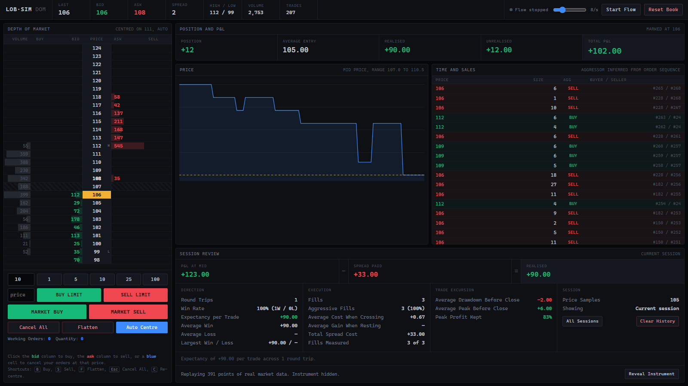

# Tradefloor

A limit order book matching engine in Python, wrapped in a depth-of-market
trading terminal that replays real market data, tracks your position and P&L,
and keeps a journal of how you actually traded.

The engine implements **price-time priority**: orders match against the best
available price first, and within a price level in the order they arrived.
Everything above it exists to exercise that core and to make practising against
it useful.

```
~125,000 orders/sec sustained on mixed flow, p99 latency 18us
insert throughput flat across a 200x increase in book size
232 tests
```



A live session above. The ladder is on the left with the last trade highlighted,
the review along the bottom, and the verdict reads
`+123.00 at mid  -  33.00 spread paid  =  +90.00 realised`.

---

## Quick start

**macOS / Linux**

```bash
python3 -m venv .venv
source .venv/bin/activate
pip install -r requirements.txt
pip install -e .
```

**Windows**

```bash
python -m venv .venv
.venv\Scripts\activate
pip install -r requirements.txt
pip install -e .
```

Run the tests:

```bash
pytest
```

Start the terminal at <http://localhost:5000>:

```bash
flask --app order_book.api:create_app run --debug
```

Download some real market data to trade against:

```bash
python scripts/fetch_prices.py stock --random
```

Benchmark the engine:

```bash
python benchmarks/benchmark.py
```

Requires Python 3.10 or newer. On macOS use `python3` and `pip3` if `python`
points at the system Python 2.

---

## The terminal

Press **Start flow** to bring the market to life, then trade into it.

The ladder follows the MD Trader convention used by discretionary futures
traders: price fixed in a centre column, bid depth to the left, ask depth to the
right, so a price level stays in the same place as the market moves.

| column | meaning |
|---|---|
| **Vol** | cumulative traded volume at that price |
| **Buy / Sell** | *your* working orders. Click to cancel them at that price |
| **Bid / Ask** | resting depth. Click to place an order there |
| **Price** | last trade highlighted, session high and low marked |

Order entry supports click-to-trade on the ladder, typed limit prices, market
orders, flatten, and cancel-all. Keyboard: `B` buy, `S` sell, `F` flatten,
`Esc` cancel all, `C` re-centre, `1` to `4` size presets.

### Real price action

Price comes from downloaded market data, not from a generator. Two sources,
normalised to the same format so nothing downstream cares which:

```bash
python scripts/fetch_prices.py stock --random          # a random liquid ticker
python scripts/fetch_prices.py stock --symbol SPY --range 5d
python scripts/fetch_prices.py crypto --symbol BTCUSDT --date 2026-07-15
```

Stocks and ETFs come from Yahoo at 1-minute resolution; crypto from Binance's
public archive at 1-second. The data is gitignored, so the script is what makes
it reproducible.

**The instrument is hidden until you reveal it.** Knowing you are looking at
TSLA imports assumptions about how it ought to behave, so a session trades an
unlabelled series and the identity is shown afterwards. A reset draws a new one.

The synthetic flow still generates the *orders*, so the book, queue position and
fills are simulated. What is real is the price path.

### Session review

Your P&L has two sources, and only one of them is skill at reading a market. The
review separates them.

**Direction** comes from your round trips: win rate, average win and loss,
expectancy per trade.

**Execution** comes from your fills, each compared against the mid price at the
moment your order arrived: how often you crossed the spread, what crossing cost
you, what resting earned you, and the total spread bill.

The headline is the arithmetic between them:

```
P&L at mid  -  Spread paid  =  Realised
```

A real session: crossing every trade was right about direction (+15 at mid) but
57 of spread turned it into -42. Another, resting orders instead: wrong about
direction (-21 at mid) but passive fills earned 11 back, ending at -10. No win
rate would tell you either of those.

**Excursions** answer a third question: did you sit through it? MAE is how far a
trade went against you before it worked, MFE how far in your favour before you
closed, and capture rate is how much of the available move you actually took. A
trade worth 12 at its best where you took 3 is a 25% capture, which is the
signature of cutting winners short.

History persists across restarts in SQLite, and can be cleared from the review
panel when you want a clean slate.

---

## Design notes

The decisions worth explaining, and why they were made that way.

### Price levels: a dict *and* a heap

Each side keeps a dict of `price -> deque` for O(1) access to any level, plus a
heap of prices for the best bid or offer. Bids negate their prices so Python's
min-heap yields the highest bid.

Emptied levels are removed from the dict but left in the heap, because `heapq`
has no cheap arbitrary removal. `best_bid()` and `best_ask()` peek the top and
discard any price no longer present in the dict. Lazy deletion keeps every
operation O(log n) instead of paying O(n) to rebuild the heap.

### FIFO within a level

Each level is a `collections.deque`, not a list. Both support append and
pop-from-front, but `list.pop(0)` is O(n) because every remaining element
shifts. Matching pops from the front on every fill, so that difference compounds.

### An order-id index

`order_id -> Order` makes cancellation a direct lookup rather than a scan across
every price level. Removal from the deque itself is still O(k) in the level's
depth, which is an acceptable trade when cancels are rarer than fills.

### Market orders never rest

A market order carries no price at all: the constructor *rejects* one that does,
and requires one for limit orders, so neither nonsensical combination can be
built. Its unfilled remainder is cancelled rather than rested, and kept out of
the id index, so no ghost order survives that a later cancel could trip over.

### P&L is not the engine's job

An order book matches orders; it has no concept of who owns them. Ownership and
P&L live in the API layer, and `Position` is a separate module.

Accounting is **average cost**: a fill that increases a position rolls the cost
basis forward, one that reduces it realises against that average, and one that
flips through flat closes the old position and rebases the new one at the fill
price. Signed quantity means long and short need no separate code paths, since
`(mark - average) * quantity` gives the correct sign for both.

The subtle part is attribution. A trade is only ever returned from the
*aggressor's* `add_order` call, so when your resting bid is lifted, that fill
surfaces in someone else's API request. Both sides are attributed from that one
result.

### The journal stores observations, not conclusions

Fills record what happened; marks record where the price went. Round trips,
excursions and every statistic are **derived** from those two tables rather than
stored alongside them. A stored result is a cache that goes stale the moment you
fix a calculation or invent a new metric, and would need every historical row
migrating to catch up. Derived, a change applies retroactively to every session
already recorded.

Round trips reuse `Position` rather than reimplementing average cost, which
makes the journal agreeing with the P&L panel structural instead of
coincidental. A test asserts the two match across several fill sequences.

### Execution is measured against the arrival price

A fill's spread cost is measured against the mid at the moment the order was
*sent*, captured before `add_order` runs. It cannot be read afterwards, because
matching has already consumed the levels it filled against, so the book then
shows where the market ended up rather than where it was. Reading it after the
fact would understate crossing cost, always in the flattering direction.

### Feeds are scaled by volatility, not by range

Fitting a session into a fixed number of ticks sounds reasonable and is useless.
A day of Bitcoin ranges 1.73%, so forty ticks makes one tick worth $28 against a
typical one-second move of $0.84, and 97% of consecutive points land on the same
tick. Scaling so a *typical move* is about half a tick leaves roughly 60% of
steps flat, which is what a real market looks like at a tradeable resolution.

### The engine is single-threaded on purpose

Real matching engines are, for determinism. Concurrency is the API layer's
problem, so Flask serialises access behind a lock and the engine stays
lock-free. The journal serialises its own connection separately, and opens it
with `check_same_thread=False` because the server answers each request on a
different thread.

---

## API

| method | path | |
|---|---|---|
| `POST` | `/orders` | submit an order. Returns fills, resting state and position |
| `GET` | `/orders/<id>` | a working order's live state, 404 once filled |
| `GET` | `/orders?ids=1,2,3` | bulk working-order lookup |
| `DELETE` | `/orders/<id>` | cancel |
| `GET` | `/book/snapshot` | the whole screen in one locked round-trip |
| `GET` | `/book/best` | best bid, best ask, spread |
| `GET` | `/book/depth` | resting quantity per price level |
| `GET` | `/trades` | trade history |
| `GET` | `/positions` and `/positions/<owner>` | position and P&L |
| `POST` | `/book/seed` | build a two-sided book in one call |
| `POST` | `/book/reset` | clear book, positions and ids, start a session |
| `GET` | `/journal/session` | the current session |
| `GET` | `/journal/fills` | recorded fills, `?all=1` for every session |
| `GET` | `/journal/stats` | session review, `?all=1` for every session |
| `POST` | `/journal/clear` | erase all history. Requires `{"confirm": true}` |
| `GET` | `/feed` | the loaded instrument, `?reveal=1` to name it |
| `GET` | `/feed/prices` | a slice of the price series |
| `GET` | `/feed/list` and `POST /feed/load` | choose a feed |
| `GET` | `/health` | liveness |

`/book/snapshot` accepts `?owner=`, `?working=1,2,3` and `?trades=N`, so a
client rendering a ladder needs one request per frame rather than several.

---

## Benchmarks

Measured **in-process**. Routing through HTTP would mostly measure Werkzeug,
which costs around 470us per order against 8us of matching, so an end-to-end
figure understates the engine by roughly 60x. The HTTP layer is reported
separately.

CPython 3.14, single run:

| scenario | ops/sec | mean | p50 | p99 |
|---|---:|---:|---:|---:|
| Order construction | 381,112 | 2.62us | 2.00us | 5.30us |
| Resting inserts, no matching | 578,522 | 1.73us | 1.20us | 3.10us |
| Crossing orders, every one matches | 204,479 | 4.89us | 4.50us | 14.20us |
| Market sweeps, multi-level | 57,209 | 17.48us | 14.00us | 40.50us |
| Cancels | 234,617 | 4.26us | 2.60us | 16.60us |
| **Mixed realistic flow** | **125,194** | **7.99us** | 2.60us | 17.90us |

Insert throughput against book size, which is the evidence that the data
structures hold up rather than an assertion that they do:

| book size | ops/sec |
|---:|---:|
| 1,000 | 448,716 |
| 10,000 | 452,509 |
| 50,000 | 464,100 |
| 200,000 | 449,462 |

The book grew **200x** and throughput was unchanged. A naive sorted-list
implementation would degrade visibly here.

One incidental finding: constructing an `Order` (2.62us) costs more than
inserting it into the book (1.73us). That is `time.time_ns()` and validation,
not matching.

These are single-machine, single-run numbers with no repeat trials. Treat them
as "on my laptop", not a guarantee.

---

## Tests

```
tests/test_api.py         87   endpoints, ownership attribution, error paths
tests/test_analysis.py    41   round trips, session stats, excursions
tests/test_book.py        23   matching, price-time priority, sweeps, cancels
tests/test_position.py    23   average cost, realised and unrealised, flips
tests/test_journal.py     17   schema, persistence, threading
tests/test_pricefeed.py   16   rescaling, downsampling, anonymity
tests/test_benchmark.py   13   harness smoke tests
tests/test_order.py       11   fields, validation, limit versus market
tests/test_setup.py        1
```

The browser layer has **no automated tests**. `templates/index.html` was
verified by driving the live page, not in the suite.

---

## Layout

```
order_book/
  order.py        the Order model and its validation
  book.py         the matching engine
  trade.py        an execution record
  position.py     average-cost position and P&L
  journal.py      SQLite storage for fills, marks and sessions
  analysis.py     round trips, session statistics, excursions
  pricefeed.py    loading and rescaling real market data
  enums.py        Side, OrderType
  api.py          Flask REST API, ownership, journalling
  templates/
    index.html    the trading terminal
benchmarks/
  benchmark.py    throughput and latency harness
scripts/
  fetch_prices.py download market data
tests/
```

---

## Not built yet

- **Trading bots to compare against.** Rule-based strategies trading the same
  book, so a session can be scored against them. Ownership and P&L are already
  per-owner, so the engine side is ready.
- **Full order-by-order replay.** The price path is real, but the book around it
  is generated. A faithful replay needs L3 market-by-order data.
- Multiple instruments. One `OrderBook` currently means one symbol.
- Iceberg orders, stop orders, self-trade prevention.
